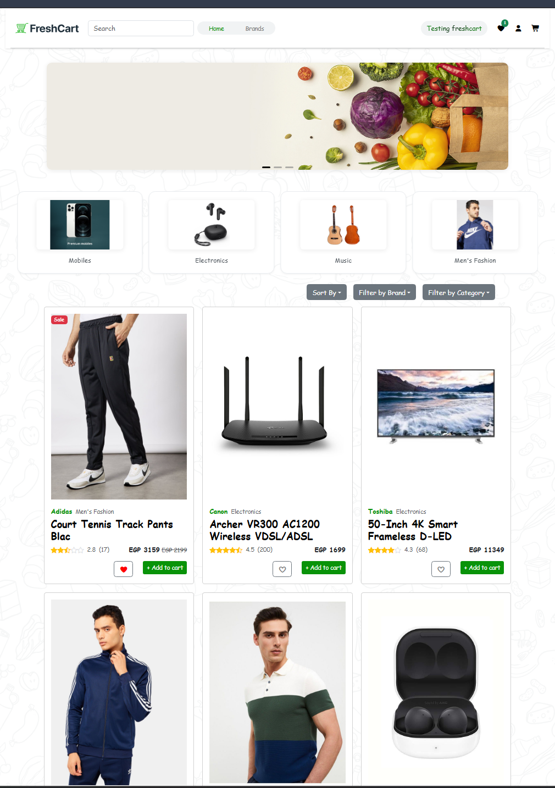
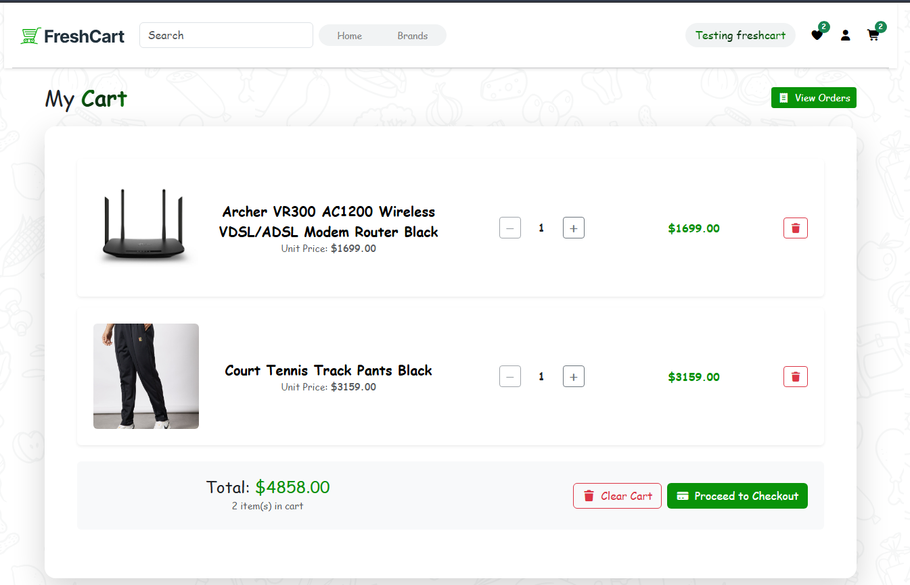
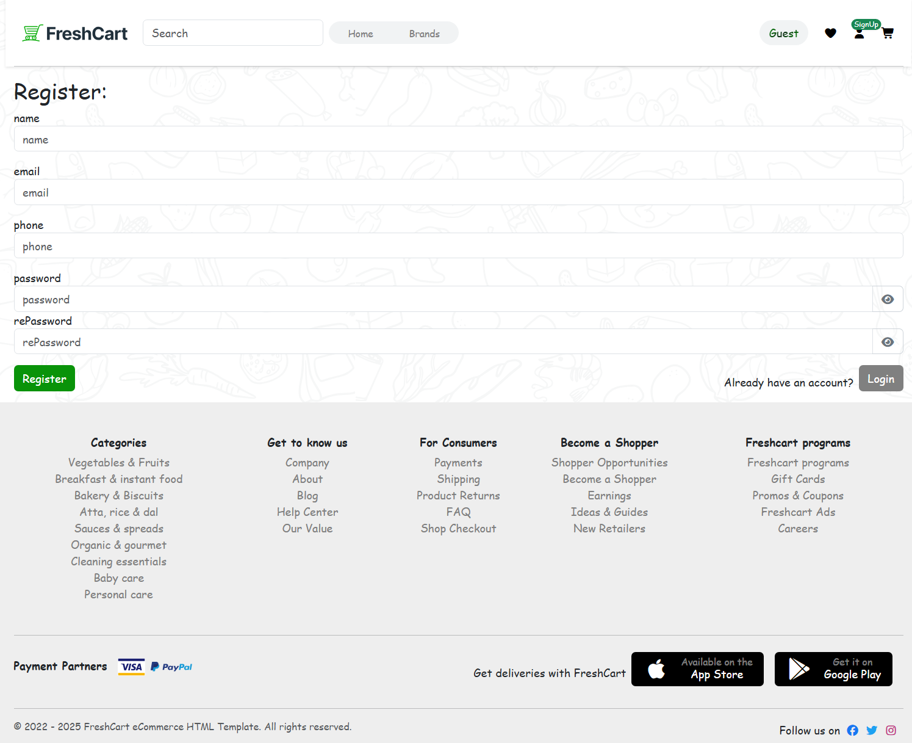
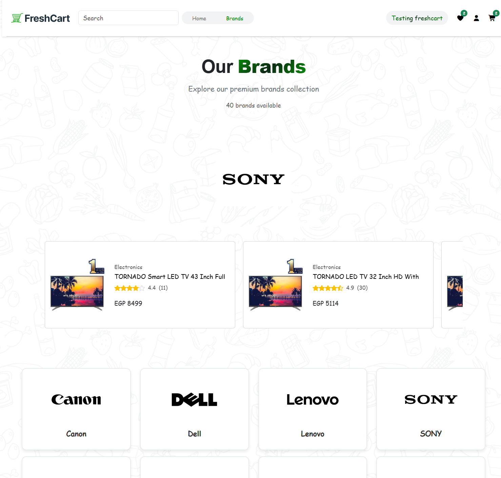
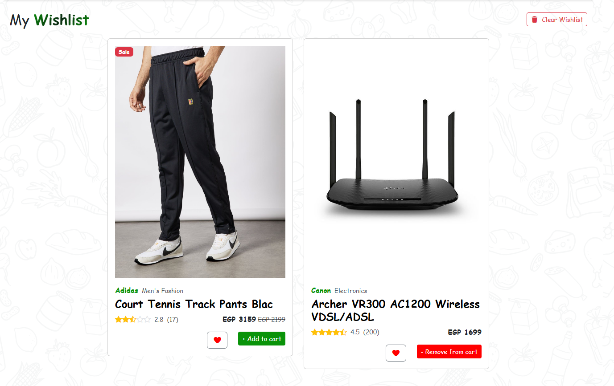
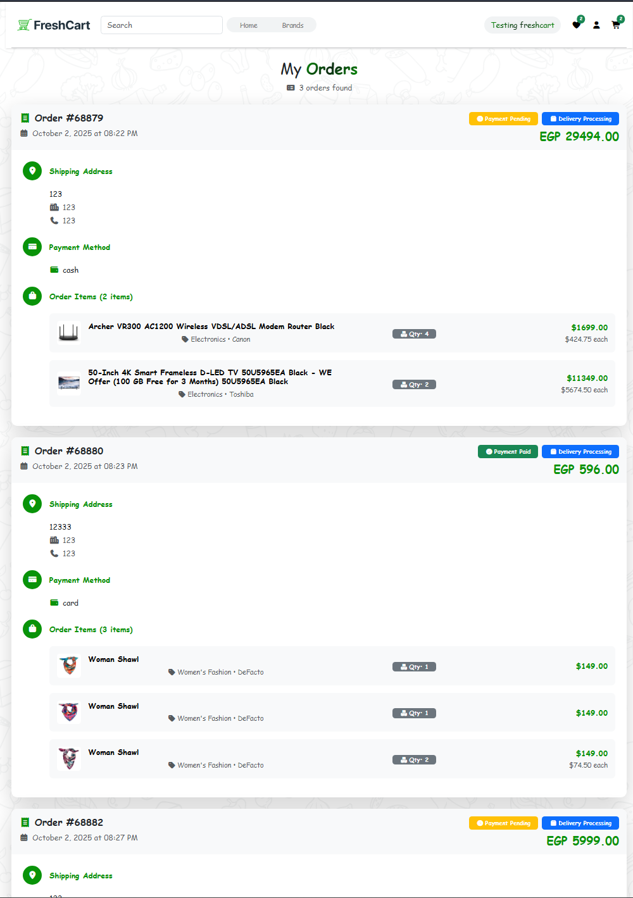
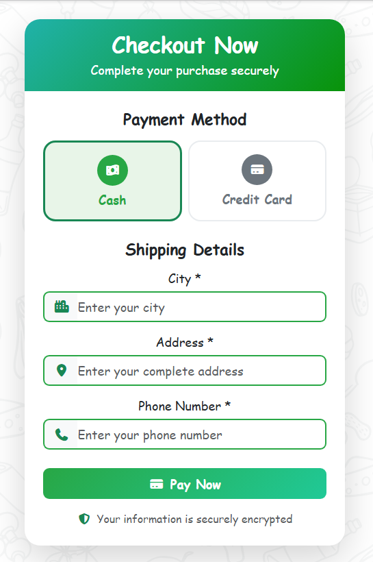
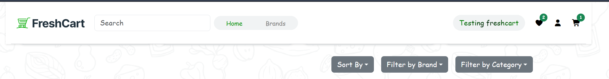

# fullstack-projects
my junior fullstack projects
# FreshCart 
### Try Out
<a href="https://marslinoed.github.io/fullstack-projects/React_Projects/freshcart/build" target="_blank">
   
</a>

A modern e-commerce web application built with React for everyday essentials.

## Features

- **Product Catalog** - Browse fresh groceries and products
- **Shopping Cart** - Add/remove items with quantity management
- **User Authentication** - Secure login and registration
- **Categories & Brands** - Filter products by categories and brands
- **Wishlist** - Save favorite items for later
- **Order Management** - Track order history and status
- **Responsive Design** - Mobile-friendly interface

## Screenshots

### Home Page


### Shopping Cart


### User Authentication


### Brands


### Wishlist


### Orders


### Checkout


### Order Confirmation


## Tech Stack

- **Frontend:** React 19, Bootstrap 5, Font Awesome
- **Routing:** React Router DOM
- **Forms:** Formik
- **HTTP Client:** Axios
- **UI Components:** React Hot Toast, Swiper
- **Styling:** Bootstrap Icons, Custom CSS

## Getting Started

```bash
# Install dependencies
npm install

# Start development server
npm start

# Build for production
npm run build
```

## Project Structure

```
src/
├── Components/
│   ├── Layout/
│   ├── Pages/
│   └── Shared/
├── Context/
├── Assets/
└── App.jsx
```

---
