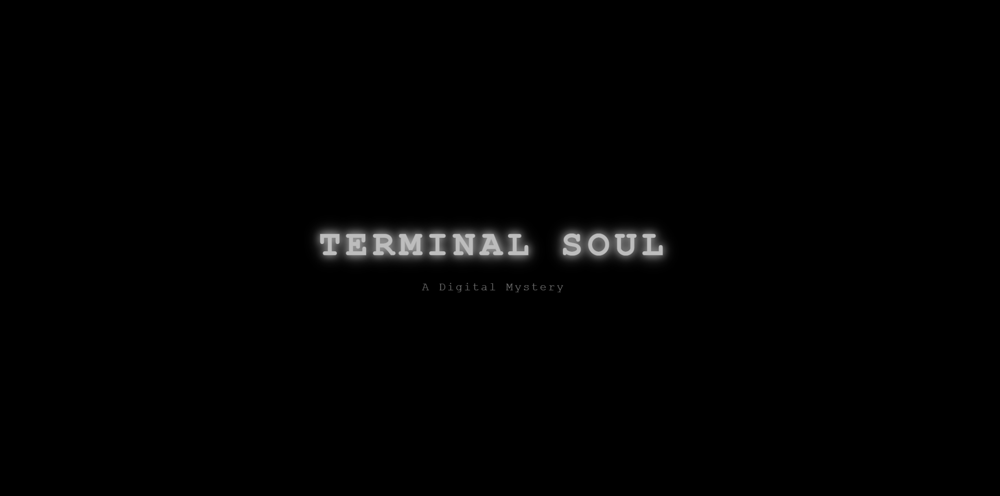

# fullstack-projects
my junior fullstack projects
# Terminal Soul 
### Try Out
<a href="https://marslinoed.github.io/fullstack-projects/React_Projects/02_Terminal-Soul_Demo/build" target="_blank">
   
</a>

*A fun, interactive terminal‑style experience built with React*

## Table of Contents
- [About the Project](#about-the-project)
- [Demo](#demo)
- [Built With](#built-with)
- [Features](#features)
- [Project Structure](#project-structure)

---

## About the Project
Terminal‑Soul Demo is a React project where the UI is styled and behaves like a command‑line terminal — think of typing commands, getting responses, navigating via text commands, etc. The idea is to merge the nostalgic “terminal” vibe with modern web UI / React‑powered interactivity.
This project was created to explore interactive UI paradigms, play with React component state & command parsing logic, and to ultimately have a little “experience” rather than just a typical list‑and‑button web app.

---

## Demo

### News Page


### Menu Page


### Transitions Page


### Commands Page


### Games Page


### Boot Page


---

## Built With
- React (create‑react‑app or your chosen scaffold)
- bootstrap css framework / Styled Components
- Node & npm for development environment

---

## Features
- Terminal‑like UI component for user interaction.
- Built‑in commands like `help`, `clear`, `manual`.
- Built‑in apps like `SmartNews`, `calender`.
- Command history navigation.
- Customizable terminal aesthetics.
- Lightweight and fast React setup.

---

## Project Structure
```
/public
  index.html
/src
  /components
    Terminal.jsx
    CommandParser.js
  /styles
    terminal.css
  App.jsx
  index.js
package.json
README.md
```
